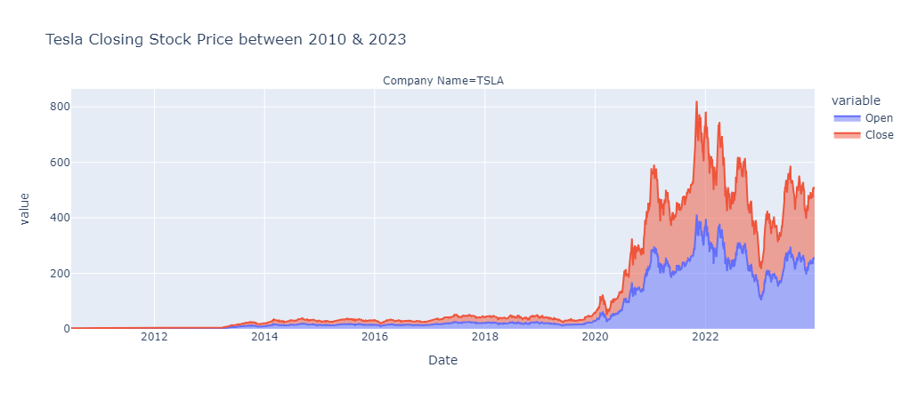
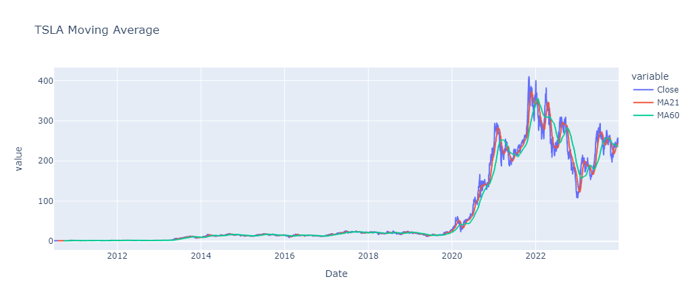
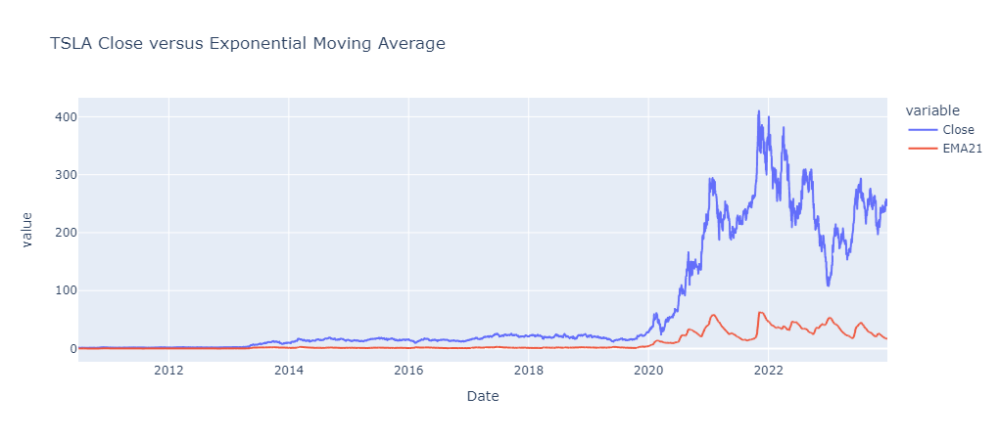

# PERSONAL PROJECT 0
## Stock Price Prediction: TSLA

## Team Members:
* Adwoa Mante(Team Lead)
* Edwin Kwadwo Tenagyei
## Introduction
Stock (also known as equity) is a security that represents the ownership of a fraction of a corporation.
This entitles the owner of the stock to a proportion of the corporation's assets and profits equal to how much stock they own.Units of stock are called "shares." A stock is a general term used to describe the ownership certificates of any company. An individual who owns a share of a company stock can be identified as a Shareholder. Stock prices change everyday by market forces. By this we mean that share prices change because of supply and demand.  If more people want to buy a stock (demand) than sell it (supply), then the price moves up. Conversely, if more people wanted to sell a stock than buy it, there would be greater supply than demand, and the price would fall. Understanding supply and demand is easy. So, why do stock prices change? The best answer is that nobody really knows for sure. Some believe that it isn't possible to predict how stocks will change in price while others think that by drawing charts and looking at past price movements, you can determine when to buy and sell. The only thing we do know as a certainty is that stocks are volatile and can change in price extremely rapidly.​
## Problem Statement
Broadly, stock market analysis is divided into two parts – Fundamental Analysis and Technical Analysis. Fundamental Analysis involves analyzing the company’s future profitability on the basis of its current business environment and financial performance. Technical Analysis, on the other hand, includes reading the charts and using statistical figures to identify the trends in the stock market. As you might have guessed, our focus will be on the technical analysis and visualization part. We’ll be using a dataset from Tesla.​
## Aims and Objectives
* Understand what stock dataset involves​
* Understand data preprocessing and data cleaning​
* Understand data visualization​
* Understand model development​
* Understand output prediction​
* Optional: Learn how to implement our models in website development​
## Machine Learning
Machine learning is the science of getting computers to act without being explicitly programmed
Machine learning is a method of data analysis that automates analytical model building​
Machine learning is important because it gives enterprises a view of trends in customer behavior and business operational patterns, as well as supports the development of new products​
## Deep Learning
* Deep learning is an artificial intelligence (AI) function that imitates the workings of the human brain in processing  data and creating patterns for use in decision making.​
* Deep learning is a subset of machine learning in artificial intelligence that has networks capable of learning unsupervised from data that is unstructured or unlabeled. Also known as deep neural learning or deep neural network.​
* Deep learning attempts to mimic the human brain—albeit far from matching its ability—enabling systems to cluster data and make predictions with incredible accuracy.​
## Deep Learning Necessity
* Deep learning has evolved hand-in-hand with the digital era, which has brought about an explosion of data in all forms and from every region of the world. This data, known simply as big data, is drawn from sources like social media, internet search engines, e-commerce platforms, and online cinemas, among others. This enormous amount of data is readily accessible and can be shared through fintech applications like cloud computing.​
* However, the data, which normally is unstructured, is so vast that it could take decades for humans to comprehend it and extract relevant information. Companies realize the incredible potential that can result from unraveling this wealth of information and are increasingly adapting to AI systems for automated support.​
## Dive into TSLA Data Cleaning and Analysis
1. TSLA stock data information was pulled from yfinance
2. A small set data of 13 years of historical data was gathered for this project
3. Next, we performed a visualized data using TSLA closing price

    
    
* Based on the close price of TSLA over the past 10 year,we can conclude that TSLA had a steady growth from 2010 up until 2020.
* In 2020, there was a sharp increase in the stock price to about $300 experiencing a drawdown between $150 and $200 price range.
* Once the stock price hit 400 there was a retracement - from a technically point of view, having Lower Lows(LL) and Higher Highs(LH)
## Algorihmic Calculations
* We performed a daily return for tsla to acccess the difference in opening price and closing price each day.
* The percent change function(pct_change) was used to calculate the daily return and visualized it.
    
## Risk Analysis 
* Due to the constant change in prices of the stock in the market. We had to perform a risk analysis implement the standard deviation, rolling statistics to understand how TSLA price are impact by these changes in the stock market.
    
    
    